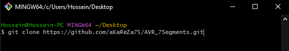
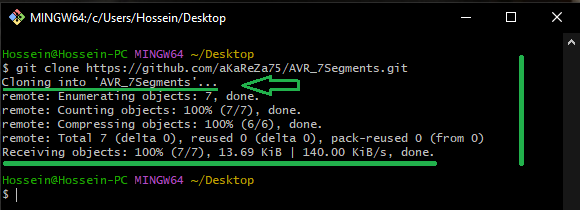
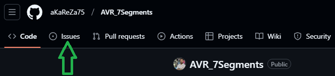
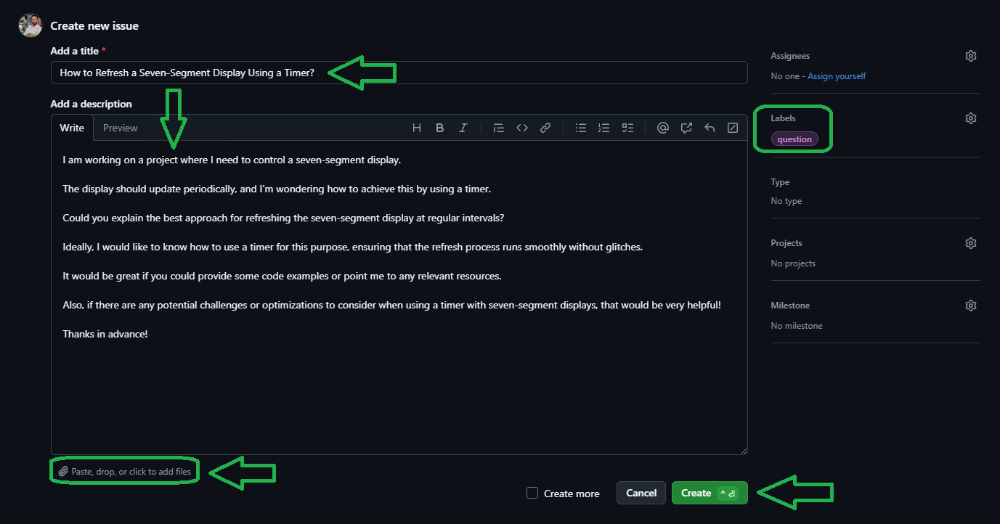

# 7-Segment Display with AVR Microcontrollers

A 7-segment display is an electronic display device used to represent numbers, letters, and sometimes other characters. It consists of seven LEDs arranged in a specific way that can be turned on or off to form different digits or characters. The display has 7 segments (labeled A to G) and an optional decimal point (DP). By turning different combinations of these segments on or off, it is possible to represent all the digits from 0 to 9, and in some cases, letters like A, b, C, etc.

> [!CAUTION]
> It is absolutely critical that you carefully read every single word of this document, line by line, to ensure you don't miss any details. Nothing can be overlooked.

> [!TIP]
> If you're looking to better understand how to navigate and use my GitHub repositories — including exploring their structure, downloading or cloning projects, submitting issues, and asking questions 
> everything you need is clearly explained in this video:  
> [aKaReZa 95 - Programming, Git - PART B](https://youtu.be/zYiUItVFRqQ)   
> Make sure to check it out!

## How a 7-Segment Display Works
A 7-segment display has 7 individual LEDs arranged in the form of a figure-eight. The following is a representation of the segments:

```
    A
  -----
F|     |B
  -----
G|     |C
  -----
    D
```

Each segment can be turned on or off, and by doing so in different combinations, you can display numbers or letters. For example, to display the number '1', you would turn on segments B and C, and leave the rest off. To display the number '8', all segments (A-G) would be turned on.

### Common Cathode vs. Common Anode

There are two types of 7-segment displays: **common cathode** and **common anode**.

- **Common Cathode**: In a common cathode display, all the cathodes (negative side) of the individual segments are connected together and are typically connected to ground (GND). Each segment is controlled by applying a HIGH signal to the corresponding anode (positive side). The segments light up when a HIGH signal is applied.

- **Common Anode**: In a common anode display, all the anodes (positive side) of the individual segments are connected together and are typically connected to the VCC (positive voltage). Each segment is controlled by applying a LOW signal to the corresponding cathode (negative side). The segments light up when a LOW signal is applied.

In both cases, each individual segment is represented by a pin, and by controlling these pins, you can display numbers. The only difference between common anode and common cathode displays is the polarity of the voltage applied to the segments.

#### Example of Segment Control for Common Cathode:
To display the number '3', the required segments are A, B, C, D, and G. In a common cathode configuration:
- Apply a HIGH signal to segments A, B, C, D, and G.
- The other segments (E, F) remain off.

#### Example of Segment Control for Common Anode:
To display the number '3', the required segments are A, B, C, D, and G. In a common anode configuration:
- Apply a LOW signal to segments A, B, C, D, and G.
- The other segments (E, F) remain off.

### 7-Segment Display Segment Control (Hexadecimal Format)

| Digit | A | B | C | D | E | F | G | Common Cathode (Hex) | Common Anode (Hex) |
|-------|---|---|---|---|---|---|---|----------------------|--------------------|
| 0     | 1 | 1 | 1 | 1 | 1 | 1 | 0 | **0x3F**             | **0xC0**           |
| 1     | 0 | 1 | 1 | 0 | 0 | 0 | 0 | **0x06**             | **0xF9**           |
| 2     | 1 | 1 | 0 | 1 | 1 | 0 | 1 | **0xB6**             | **0x49**           |
| 3     | 1 | 1 | 1 | 1 | 0 | 0 | 1 | **0x9E**             | **0x41**           |
| 4     | 0 | 1 | 1 | 0 | 0 | 1 | 1 | **0x66**             | **0x99**           |
| 5     | 1 | 0 | 1 | 1 | 0 | 1 | 1 | **0x5E**             | **0x62**           |
| 6     | 1 | 0 | 1 | 1 | 1 | 1 | 1 | **0x7E**             | **0x32**           |
| 7     | 1 | 1 | 1 | 0 | 0 | 0 | 0 | **0x4E**             | **0xB9**           |
| 8     | 1 | 1 | 1 | 1 | 1 | 1 | 1 | **0x7F**             | **0x30**           |
| 9     | 1 | 1 | 1 | 1 | 0 | 1 | 1 | **0x6E**             | **0x51**           |
| A     | 1 | 1 | 1 | 0 | 1 | 1 | 1 | **0x7B**             | **0x5A**           |
| B     | 0 | 1 | 1 | 1 | 1 | 1 | 1 | **0x3E**             | **0x6A**           |
| C     | 1 | 0 | 0 | 1 | 1 | 1 | 1 | **0x5C**             | **0x74**           |
| D     | 0 | 1 | 1 | 1 | 1 | 0 | 1 | **0x7A**             | **0x3A**           |
| E     | 1 | 0 | 0 | 1 | 1 | 1 | 1 | **0x7D**             | **0x6E**           |
| F     | 1 | 0 | 0 | 0 | 1 | 1 | 1 | **0x5F**             | **0x5E**           |

#### Explanation:
- **A, B, C, D, E, F, G** represent the segments of the 7-segment display.
  - **1** means the segment is ON.
  - **0** means the segment is OFF.

- **Common Cathode**:
  - In a **common cathode** configuration, a **HIGH** signal turns on the segment.
  - The hexadecimal values are based on this configuration, where the bits represent which segments are on (1) or off (0).

- **Common Anode**:
  - In a **common anode** configuration, a **LOW** signal turns on the segment.
  - The hexadecimal values for this configuration are inverted compared to the common cathode because the logic is reversed.


```c
/* Common Cathode (Hex values for digits 0-15) */
const uint8_t Seg7_cc[16] = 
{
    0x3F, // 0
    0x06, // 1
    0xB6, // 2
    0x9E, // 3
    0x66, // 4
    0x5E, // 5
    0x7E, // 6
    0x4E, // 7
    0x7F, // 8
    0x6E, // 9
    0x7B, // A
    0x3E, // B
    0x5C, // C
    0x7A, // D
    0x7D, // E
    0x5F  // F
};

/* Common Anode (Hex values for digits 0-15) */
const uint8_t Seg7_ca[16] = 
{
    0xC0, // 0
    0xF9, // 1
    0x49, // 2
    0x41, // 3
    0x99, // 4
    0x62, // 5
    0x32, // 6
    0xB9, // 7
    0x30, // 8
    0x51, // 9
    0x5A, // A
    0x6A, // B
    0x74, // C
    0x3A, // D
    0x6E, // E
    0x5E  // F
};
```

## Multiplexing with 4-Digit 7-Segment Display

When working with multiple 7-segment displays (e.g., a 4-digit display), the microcontroller typically uses a technique called **multiplexing** to manage the display of each digit. Multiplexing allows you to control several digits with fewer pins by switching between the digits rapidly in a way that makes it appear as though all digits are displayed simultaneously.

```
    4        3        2        1
  -----    -----    -----    -----
 |     |  |     |  |     |  |     |
  -----    -----    -----    -----
 |     |  |     |  |     |  |     |
  -----    -----    -----    -----
```

### How Multiplexing Works:
In multiplexing, the microcontroller switches between digits one by one, activating only one digit at a time while keeping the others turned off. Each digit is displayed for a short period, and the cycle repeats for the next digit. The human eye perceives this rapid switching as continuous display of all digits.

- **Each digit** of the 7-segment display has its own common pin (e.g., the common cathode or common anode), and these common pins are controlled to switch between digits.
- **For example**, for a 4-digit display, you have four common pins, each connected to one of the 7-segment displays. The segments of the display are connected to GPIO pins of the microcontroller, and only one digit is activated at a time.

#### How Digits are Displayed:
1. The microcontroller lights up the first digit (e.g., the first 7-segment display).
2. The corresponding segments are activated to show the number.
3. The microcontroller turns off the first digit and turns on the second digit.
4. The same process repeats for the third and fourth digits.
5. The cycle continues at a fast enough rate that it seems like all digits are being displayed at once.

This process is done so quickly (at a high refresh rate) that the human eye perceives a smooth, continuous display of all four digits.

### Refresh Rate for Multiplexing:
To avoid flickering or noticeable gaps in the display, the microcontroller needs to switch between digits at a rate that is fast enough for the human eye to not notice the switching. The general rule of thumb is to refresh the display **at least 50 Hz**, which means the display should be updated 50 times per second. 

- For **4 digits**, this means that each digit should be displayed for approximately 1/4th of the total refresh cycle.
- The **total refresh rate** for all four digits is typically set at **50 Hz** or higher. This implies that each digit should be refreshed approximately every **5 ms** (milliseconds).

Thus, for a 50 Hz refresh rate:
- Each digit should be displayed for around **5 ms** before switching to the next digit.

If you want to achieve a smoother display with no visible flickering, it's ideal to aim for a refresh rate of **100 Hz or higher**. This means each digit would be refreshed every **2.5 ms**.

#### Example Calculation:
- If you're targeting a **refresh rate of 100 Hz**, the total time to refresh all four digits would be 10 ms (since 1 / 100 Hz = 10 ms).
- For each digit to be displayed in this 10 ms cycle, each digit should be refreshed for approximately **2.5 ms** (since 10 ms ÷ 4 digits = 2.5 ms per digit).

## API Reference

The following API functions are designed to help with controlling 7-segment displays on the ATMEGA328 microcontroller.

> [!NOTE]  
> The library and all of its APIs provided below have been developed by myself.  
This library utilizes various macros defined in the `aKaReZa.h` header file, which are designed to simplify bitwise operations and register manipulations.    
Detailed descriptions of these macros can be found at the following link:  
> [https://github.com/aKaReZa75/AVR/blob/main/Macros.md](https://github.com/aKaReZa75/AVR/blob/main/Macros.md)  


### Flexible Pin Assignment
This library allows you to easily control 7-segment displays, and it is designed with flexibility in mind. Each segment of the 7-segment display (A through G) can be connected to any available pin of the ATMEGA328 microcontroller. This flexibility is crucial because it allows you to customize the pin connections based on your design needs, without being restricted by predefined hardware mappings.

To make pin configuration easier and more manageable, the `Seg7.h` header file defines a set of macros that allow the user to specify which microcontroller pins should be used for each segment and digit control. This means that each segment (A, B, C, D, E, F, G, and the DP) can be assigned to any GPIO pin of the ATMEGA328.

### Example Pin Configuration
In the `Seg7.h` header file, you'll find a set of macros that define the pin assignments for the 7-segment display. These macros are set to specific pins by default, but you can easily change them to any other pin on the microcontroller. For instance, the default configuration may look like this:

> [!NOTE]
These default pin assignments are based on the pin configuration for the 7-segment shield, as found in the [7Segment Shield](https://github.com/aKaReZa75/eBoard_7Segments) repository.

```c
#define _7Seg_A_Control PORTC
#define _7Seg_A_Config  DDRC
#define _7Seg_A_Pin     0

#define _7Seg_B_Control PORTC
#define _7Seg_B_Config  DDRC
#define _7Seg_B_Pin     1

#define _7Seg_C_Control PORTC
#define _7Seg_C_Config  DDRC
#define _7Seg_C_Pin     2

#define _7Seg_D_Control PORTC
#define _7Seg_D_Config  DDRC
#define _7Seg_D_Pin     3

#define _7Seg_E_Control PORTD
#define _7Seg_E_Config  DDRD
#define _7Seg_E_Pin     0

#define _7Seg_F_Control PORTD
#define _7Seg_F_Config  DDRD
#define _7Seg_F_Pin     1

#define _7Seg_G_Control PORTD
#define _7Seg_G_Config  DDRD
#define _7Seg_G_Pin     4

#define _7Seg_DP_Control PORTD
#define _7Seg_DP_Config DDRD
#define _7Seg_DP_Pin    7

#define _7Seg_Digit1_Control PORTB
#define _7Seg_Digit1_Config DDRB
#define _7Seg_Digit1_Pin   0

#define _7Seg_Digit2_Control PORTB
#define _7Seg_Digit2_Config DDRB
#define _7Seg_Digit2_Pin   1

#define _7Seg_Digit3_Control PORTB
#define _7Seg_Digit3_Config DDRB
#define _7Seg_Digit3_Pin   2

#define _7Seg_Digit4_Control PORTB
#define _7Seg_Digit4_Config DDRB
#define _7Seg_Digit4_Pin   4
```

#### How It Works
- The macros defined in the `Seg7.h` file specify which microcontroller pins are used for each segment and each digit of the 7-segment display.
- For example:
  - `_7Seg_A_Control` and `_7Seg_A_Pin` correspond to the control port (PORTC) and pin (pin 0) for segment A.
  - Similarly, `_7Seg_B_Control` and `_7Seg_B_Pin` define the port and pin for segment B, and so on for the remaining segments and digits.
  
- By using these macros, you can configure each segment and each digit of the display to any port and pin you choose, just by modifying the macro definitions. This flexibility allows you to adapt the code to your specific hardware setup, making it ideal for a wide range of projects.

For example, if you want to change the pin for segment A to pin 5 of PORTB, you can modify the macro like this:

```c
#define _7Seg_A_Control PORTB
#define _7Seg_A_Config  DDRB
#define _7Seg_A_Pin     5
```

This allows you to control which pins are connected to each segment, ensuring that you have full control over your display setup.

### **Initialization**
```c
void Seg7_init(void);
```
* Initializes the 7-segment display configuration.
* This function sets the appropriate pin directions for controlling the segments and digits of the 7-segment display.
* It configures all the necessary pins as output.
  
**Default Configuration**

| **Segment/Digit**         | **Control Port & Pin**   |
|---------------------------|--------------------------|
| **Type of 7-Segment**      | Common Cathode           |
| **Number of Digits**       | 4                        |
| **Segment A**              | PORTC, Pin 0             |
| **Segment B**              | PORTC, Pin 1             |
| **Segment C**              | PORTC, Pin 2             |
| **Segment D**              | PORTC, Pin 3             |
| **Segment E**              | PORTD, Pin 0             |
| **Segment F**              | PORTD, Pin 1             |
| **Segment G**              | PORTD, Pin 4             |
| **Decimal Point (DP)**     | PORTD, Pin 7             |
| **Digit 1 (Thousands)**    | PORTB, Pin 0             |
| **Digit 2 (Hundreds)**     | PORTB, Pin 1             |
| **Digit 3 (Tens)**         | PORTB, Pin 2             |
| **Digit 4 (Ones)**         | PORTB, Pin 4             |  
  
**Example:**
```c
#include "aKaReZa.h"
#include "Seg7.h"

int main(void) 
{
    Seg7_init(); /**< Initialize the 7-segment display */
    while(1)
    {
        /* Your code here to display values */
    }
}
```

### **Display Number**
```c
void Seg7_Puti(uint16_t _7SegValue);
```
* Displays a 4-digit number on the multiplexed 7-segment display.
* This function uses multiplexing to display the digits sequentially with a short delay between each to simulate continuous display of the 4-digit value.
* It will handle turning on the correct segments for each digit.

> [!IMPORTANT]
Currently, only **positive integers** between **0 and 9999** can be displayed.   
Additionally, only a **4-digit 7-segment display** is supported at the moment. 


**Example:**
```c
#include "aKaReZa.h"
#include "Seg7.h"

int main(void) 
{
    Seg7_init(); /**< Initialize the 7-segment display */
    while(1)
    {
        Seg7_Puti(1234); /**< Display the number 1234 */
    }
}
```

> [!CAUTION]
For continuous display, the `Seg7_Puti` function needs to be executed continuously.    
It is recommended to use a **timer** to trigger the execution of the function at a fixed interval.   
This will prevent delays in the main program loop and ensure smoother performance by automating the multiplexing refresh.

## Summary

Here’s a quick summary of the available functions:

| Function Name        | Description                                      |
|----------------------|--------------------------------------------------|
| `Seg7_init()`         | Initializes the 7-segment display configuration. |
| `Seg7_Puti(uint16_t)` | Displays a 4-digit value on the multiplexed 7-segment display. |

## Complete Example

The following example demonstrates how to initialize the 7-segment display, display a 4-digit number using multiplexing, and use a timer interrupt to update the display continuously.

```c
#include "aKaReZa.h"
#include "Seg7.h"

/* Timer0 Overflow Interrupt Service Routine (ISR) */
ISR(TIMER0_OVF_vect)
{
    Seg7_Puti(1234);  /* Update the 7-segment display */
};

int main(void) 
{
    Seg7_init(); /**< Initialize the 7-segment display */
    
    Timer0_Init(Initialize); /**< Initialize Timer0 for periodic updates */
    
    globalInt_Enable(); /**< Enable global interrupts */
    
    while(1)
    {
        /* Main loop can be used for other tasks, the display will update automatically via Timer0 interrupt */
    };
};
```

### Explanation:

In this example, the 7-Segments will be updated continuously at the specified interval (1ms in this case) due to the timer interrupt.

## Important Notes

- **Multiplexing**: The 7-segment display operates using multiplexing, meaning each digit is displayed sequentially for a short period. This creates the illusion that all digits are visible at once. Ensure that the refresh rate is set appropriately to avoid flickering.
- **Power Consumption**: Be cautious about power consumption when driving multiple 7-segment displays, as this can draw significant current.
- **Pin Configuration**: Make sure the correct pins are defined in the header file. If you modify the microcontroller's pin configuration or use different segments, update the pin assignments accordingly.
- **Delay Timing**: If the delay between digit switching is too short, the display may become unreadable. If it’s too long, the display might appear sluggish.
- **Initialization**: Don’t forget to initialize the 7-segment display by calling `Seg7_init()`.
- **Wiring Issues**: Ensure that the segments and common cathodes/anodes are wired correctly.
- **Low Refresh Rate**: A refresh rate below 50 Hz may cause visible flickering, making the display hard to read.


# 🔗 Resources
  Here you'll find a collection of useful links and videos related to the topic of AVR microcontrollers.  

<table style="border-collapse: collapse;">
  <tr>
    <td valign="top" style="padding: 0 10px;">
      <h3 style="margin: 0;">
        <a href="https://youtu.be/HGlJtcpjZ-E">aKaReZa 44 – AVR, 7Segment - Part A</a>
      </h3>
      <p style="margin: 8px 0 0;">
        Learn how to set up a common anode 7-segment display with an AVR microcontroller on a breadboard, and then multiplex a four-digit 7-segment display using a custom shield to improve code readability.
      </p>
    </td>
    <td width="360" valign="top" style="padding: 0;">
      <a href="https://youtu.be/HGlJtcpjZ-E">
        
      </a>
    </td>
  </tr>

  <tr>
    <td valign="top" style="padding: 0 10px;">
      <h3 style="margin: 0;">
        <a href="https://youtu.be/_pwxBJ06aMk">aKaReZa 47 – AVR, 7Segment - Part B</a>
      </h3>
      <p style="margin: 8px 0 0;">
        Continuation of setting up 7-segment displays, building a counter, adding button functionality, displaying digits, optimizing code, and adding macros.
      </p>
    </td>
    <td width="360" valign="top" style="padding: 0;">
      <a href="https://youtu.be/_pwxBJ06aMk">
        
      </a>
    </td>
  </tr>

  <tr>
    <td valign="top" style="padding: 0 10px;">
      <h3 style="margin: 0;">
        <a href="https://youtu.be/5OG6KQWCLCA">aKaReZa 53 – AVR, 7Segment - Part C</a>
      </h3>
      <p style="margin: 8px 0 0;">
        Continuation of setting up 7-segment displays, addressing three software issues: modular code writing, display refresh during button press, and one-second counting.
      </p>
    </td>
    <td width="360" valign="top" style="padding: 0;">
      <a href="https://youtu.be/5OG6KQWCLCA">
        
      </a>
    </td>
  </tr>
</table>

  
> [!TIP]
> The resources are detailed in the sections below.  
> To access any of them, simply click on the corresponding blue link.

- [AVR Microntroller](https://github.com/aKaReZa75/AVR)
  ---  
    This repository contains comprehensive resources for AVR microcontrollers, including hardware schematics, software libraries, and educational projects.

# 💻 How to Use Git and GitHub
To access the repository files and save them on your computer, there are two methods available:
1. **Using Git Bash and Cloning the Repository**
   - This method is more suitable for advanced users and those familiar with command-line tools.
   - By using this method, you can easily receive updates for the repository.

2. **Downloading the Repository as a ZIP file**
   - This method is simpler and suitable for users who are not comfortable with command-line tools.
   - Note that with this method, you will not automatically receive updates for the repository and will need to manually download any new updates.

## Clone using the URL.
First, open **Git Bash** :
-  Open the folder in **File Explorer** where you want the library to be stored.
-  **Right-click** inside the folder and select the option **"Open Git Bash here"** to open **Git Bash** in that directory.


> [!NOTE] 
> If you do not see the "Open Git Bash here" option, it means that Git is not installed on your system.  
> You can download and install Git from [this link](https://git-scm.com/downloads).  
> For a tutorial on how to install and use Git, check out [this video](https://youtu.be/BsykgHpmUt8).
  
-  Once **Git Bash** is open, run the following command to clone the repository:

 ```bash
git clone https://github.com/aKaReZa75/AVR_7Segments.git
```
- You can copy the above command by either:
- Clicking on the **Copy** button on the right of the command.
- Or select the command text manually and press **Ctrl + C** to copy.
- To paste the command into your **Git Bash** terminal, use **Shift + Insert**.



- Then, press Enter to start the cloning operation and wait for the success message to appear.



> [!IMPORTANT]
> Please keep in mind that the numbers displayed in the image might vary when you perform the same actions.  
> This is because repositories are continuously being updated and expanded. Nevertheless, the overall process remains unchanged.

> [!NOTE]
> Advantage of Cloning the Repository:  
> - **Receiving Updates:** By cloning the repository, you can easily and automatically receive new updates.  
> - **Version Control:** Using Git allows you to track changes and revert to previous versions.  
> - **Team Collaboration:** If you are working on a project with a team, you can easily sync changes from team members and collaborate more efficiently.  

## Download Zip
If you prefer not to use Git Bash or the command line, you can download the repository directly from GitHub as a ZIP file.  
Follow these steps:  
1. Navigate to the GitHub repository page and Locate the Code button:
   - On the main page of the repository, you will see a green Code button near the top right corner.

2. Download the repository:
   - Click the Code button to open a dropdown menu.
   - Select Download ZIP from the menu.

    

3. Save the ZIP file:
   - Choose a location on your computer to save the ZIP file and click Save.

4. Extract the ZIP file:
   - Navigate to the folder where you saved the ZIP file.
   - Right-click on the ZIP file and select Extract All... (Windows) or use your preferred extraction tool.
   - Choose a destination folder and extract the contents.

5. Access the repository:
   - Once extracted, you can access the repository files in the destination folder.

> [!IMPORTANT]
> - No Updates: Keep in mind that downloading the repository as a ZIP file does not allow you to receive updates.    
>   If the repository is updated, you will need to download it again manually.  
> - Ease of Use: This method is simpler and suitable for users who are not comfortable with Git or command-line tools.

# 📝 How to Ask Questions
If you have any questions or issues, you can raise them through the **"Issues"** section of this repository. Here's how you can do it:  

1. Navigate to the **"Issues"** tab at the top of the repository page.  

  

2. Click on the **"New Issue"** button.  
   
  

3. In the **Title** field, write a short summary of your issue or question.  

4. In the "Description" field, detail your question or issue as thoroughly as possible. You can use text formatting, attach files, and assign the issue to someone if needed. You can also use text formatting (like bullet points or code snippets) for better readability.  

5. Optionally, you can add **labels**, **type**, **projects**, or **milestones** to your issue for better categorization.  

6. Click on the **"Submit new issue"** button to post your question or issue.
   
  

I will review and respond to your issue as soon as possible. Your participation helps improve the repository for everyone!  

> [!TIP]
> - Before creating a new issue, please check the **"Closed"** section to see if your question has already been answered.  
>     
> - Write your question clearly and respectfully to ensure a faster and better response.  
> - While the examples provided above are in English, feel free to ask your questions in **Persian (فارسی)** as well.  
> - There is no difference in how they will be handled!  

> [!NOTE]
> Pages and interfaces may change over time, but the steps to create an issue generally remain the same.

# 🤝 Contributing to the Repository
To contribute to this repository, please follow these steps:
1. **Fork the Repository**  
2. **Clone the Forked Repository**  
3. **Create a New Branch**  
4. **Make Your Changes**  
5. **Commit Your Changes**  
6. **Push Your Changes to Your Forked Repository**  
7. **Submit a Pull Request (PR)**  

> [!NOTE]
> Please ensure your pull request includes a clear description of the changes you’ve made.
> Once submitted, I will review your contribution and provide feedback if necessary.

# 🌟 Support Me
If you found this repository useful:
- Subscribe to my [YouTube Channel](https://www.youtube.com/@aKaReZa75).
- Share this repository with others.
- Give this repository and my other repositories a star.
- Follow my [GitHub account](https://github.com/aKaReZa75).

# 📜 License
This project is licensed under the GPL-3.0 License. This license grants you the freedom to use, modify, and distribute the project as long as you:
- Credit the original authors: Give proper attribution to the original creators.
- Disclose source code: If you distribute a modified version, you must make the source code available under the same GPL license.
- Maintain the same license: When you distribute derivative works, they must be licensed under the GPL-3.0 too.
- Feel free to use it in your projects, but make sure to comply with the terms of this license.
  
# ✉️ Contact Me
Feel free to reach out to me through any of the following platforms:
- 📧 [Email: aKaReZa75@gmail.com](mailto:aKaReZa75@gmail.com)
- 🎥 [YouTube: @aKaReZa75](https://www.youtube.com/@aKaReZa75)
- 💼 [LinkedIn: @akareza75](https://www.linkedin.com/in/akareza75)
